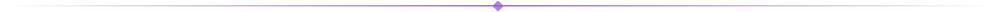

<div align="center">



<br/>


<br/>

<!--
  Add more badges once you have the links ready — copy a line, swap the URL and label:
  <a href="https://linkedin.com/in/YOUR-HANDLE"></a>
  <a href="https://leetcode.com/u/YOUR-HANDLE"></a>
  <a href="https://your-portfolio.dev"></a>
-->

</div>



```bash
> whoami

sameer chore
b.tech cse @ sggsie&t, nanded — third year

exploring:
├── software development and clean system design
├── ai/ml, one model and one dataset at a time
├── open-source, reading code before writing it
└── problem solving, daily reps over big leaps

currently:
└── building the projects and write-ups that will fill this README in
```


## ✦ About me

Third-year CSE undergrad at SGGSIE&T, Nanded. I'd rather understand why something works than memorise that it does, and that's shaped how I spend most of my time.

Software development is the throughline — writing programs that are readable six months later, not just working today. AI/ML is the part I'm most curious about right now, so most of my "spare time" project work lives there.

Open source is how I'm learning to read other people's code, and problem solving — DSA, puzzles, the occasional contest — is the daily habit that keeps the fundamentals sharp.


<br/>

## ⚡ Tech stack

<!--
  This is a starter list based on a typical TY CSE curriculum plus your stated interests.
  Edit it to match exactly what you've actually used — add or remove badges freely,
  shields.io has a badge for almost everything: https://shields.io
-->

**◆ Languages**
<br/>
    

**◆ Tools & platforms**
<br/>
   

**◆ Currently exploring**
<br/>
  


## ◈ By the numbers

<div align="center">


</div>

<div align="center">



</div>
